# Casos replicados

## Caso 1
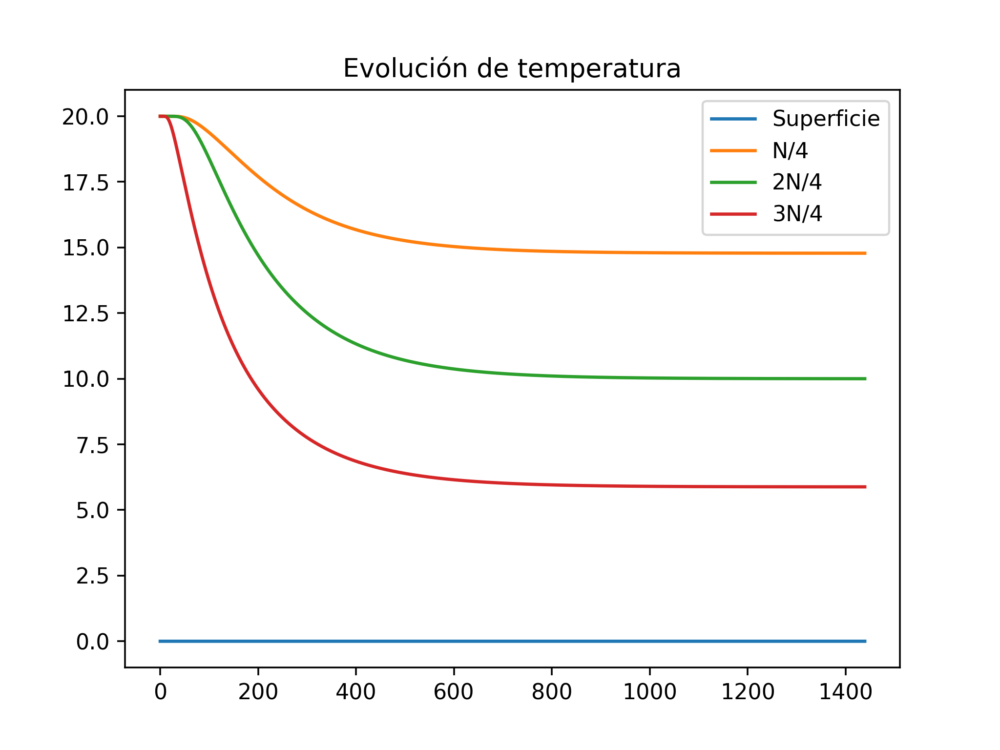
## Caso 2
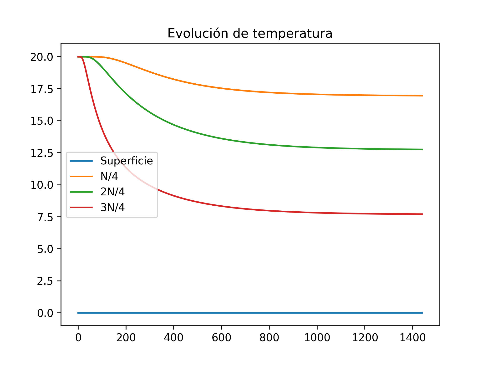
## Caso 3
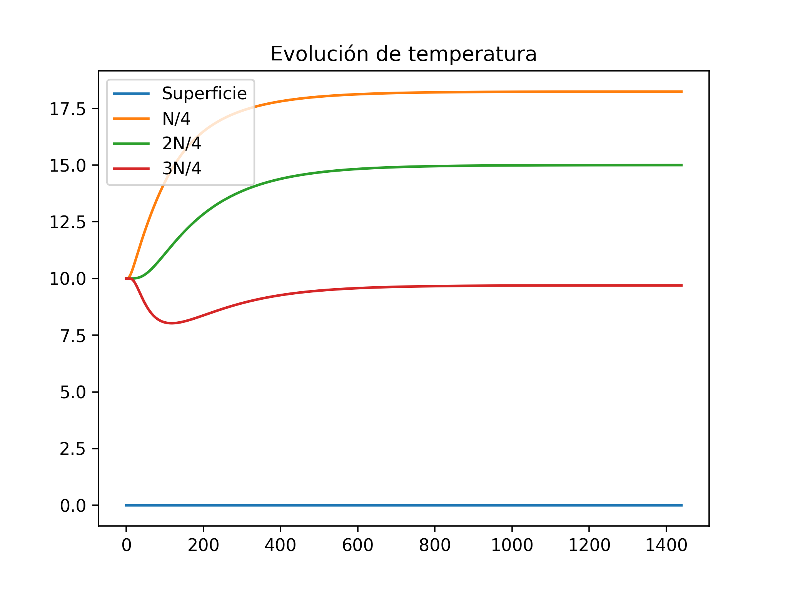
## Caso 4
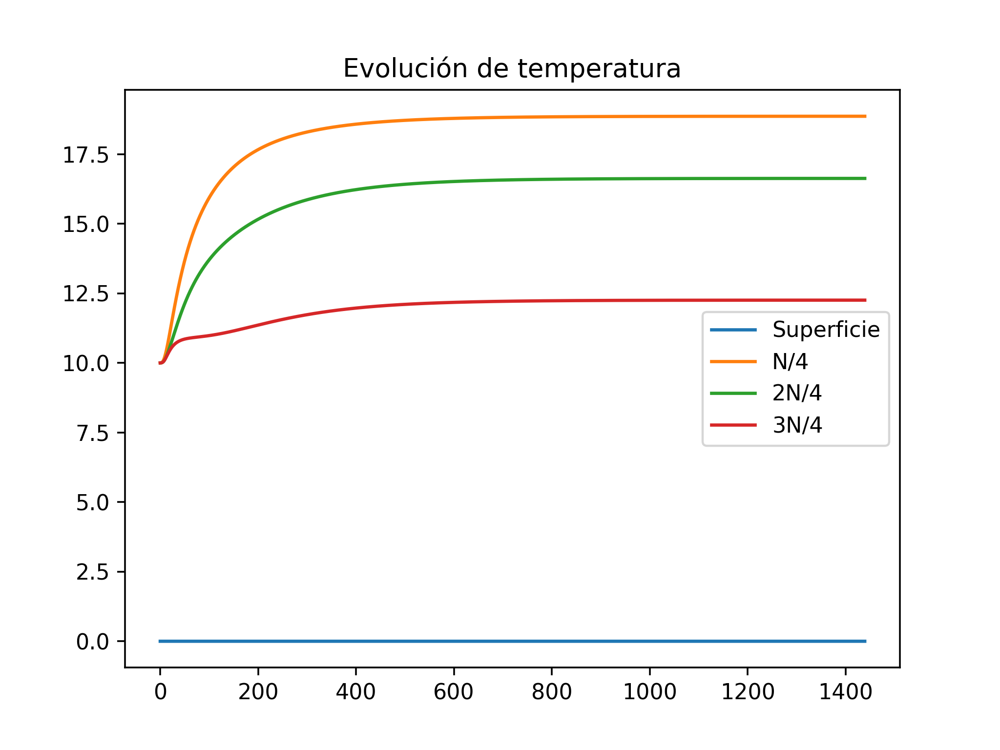
## Caso 5
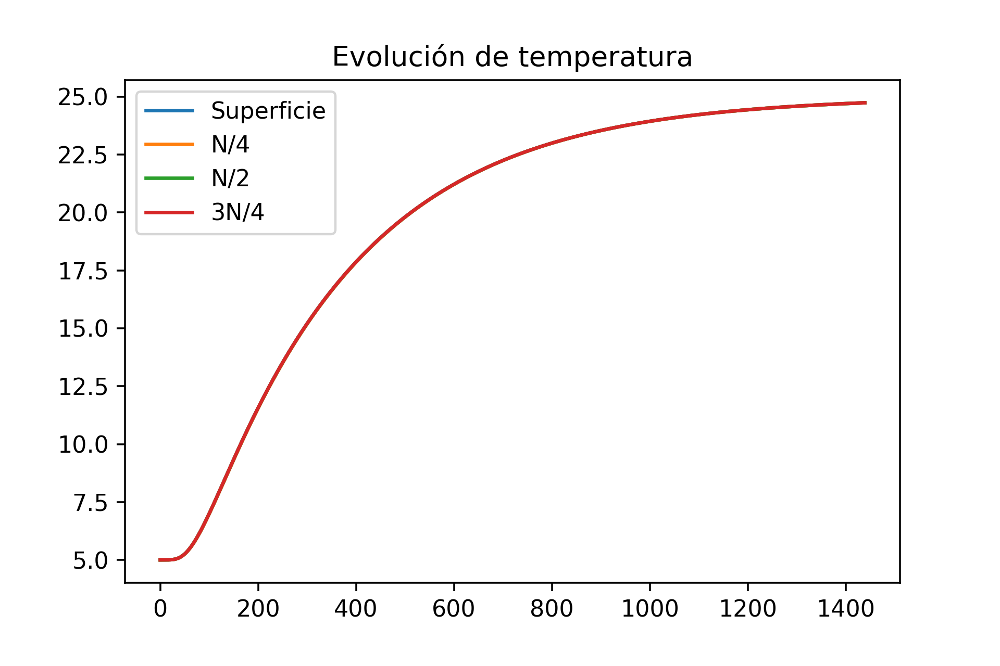
## Caso 6
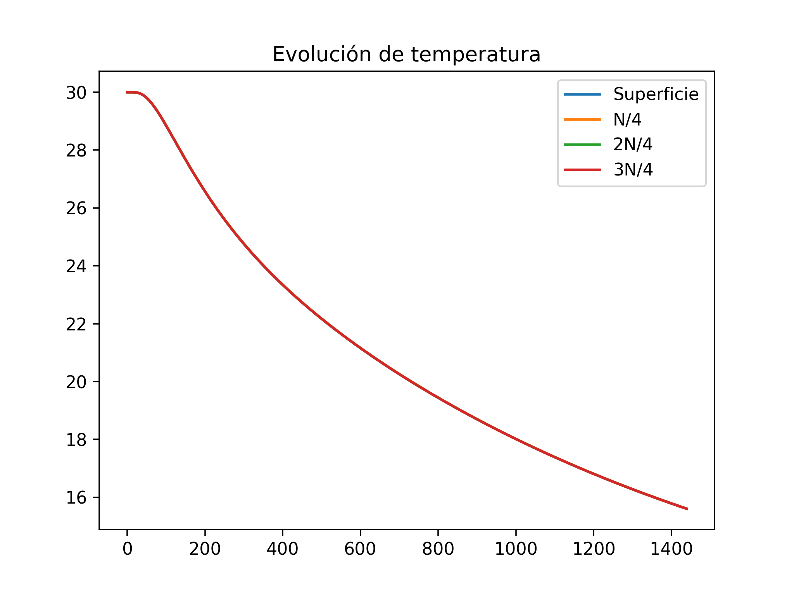
## Caso 7
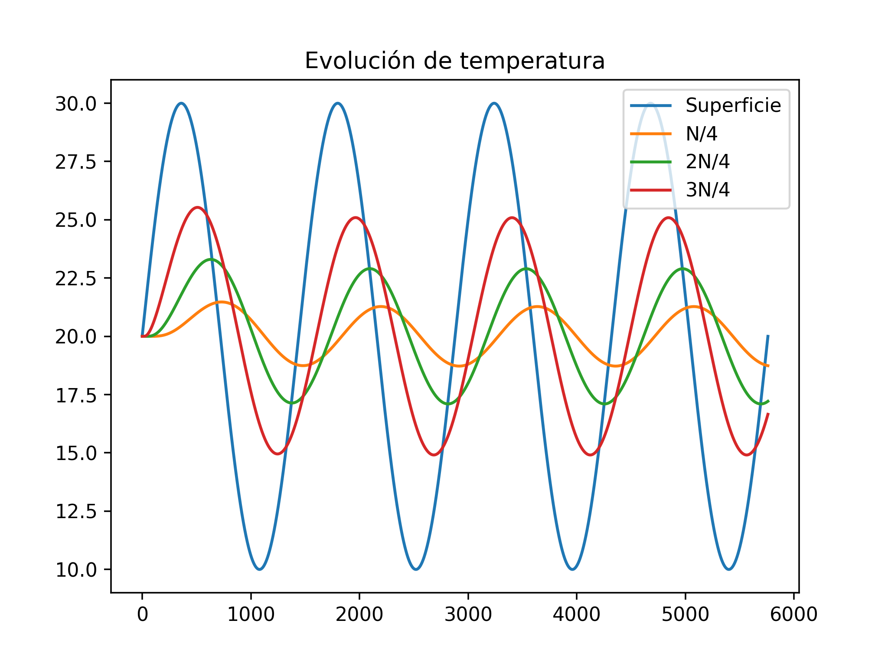

# Descripción

# Evolución de la temperatura en el tiempo en los puntos 

## Caso 1
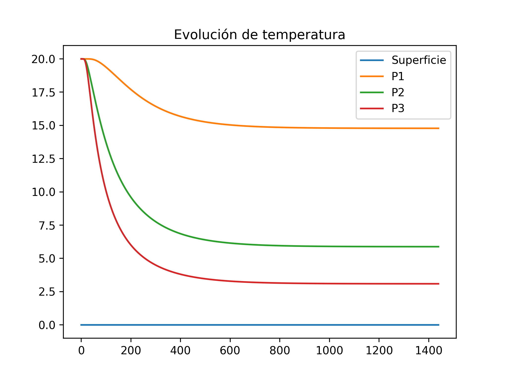
## Caso 2
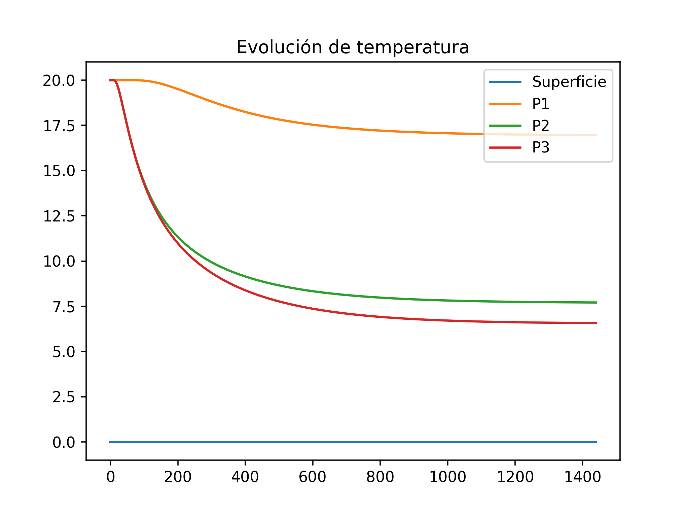
## Caso 3
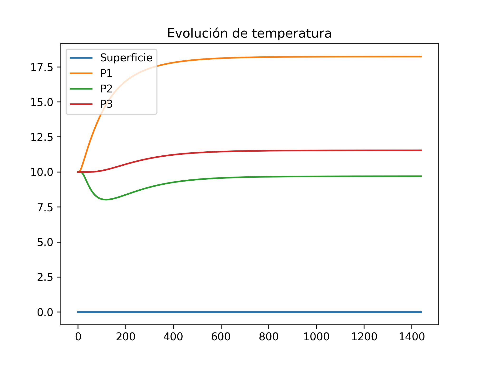
## Caso 4
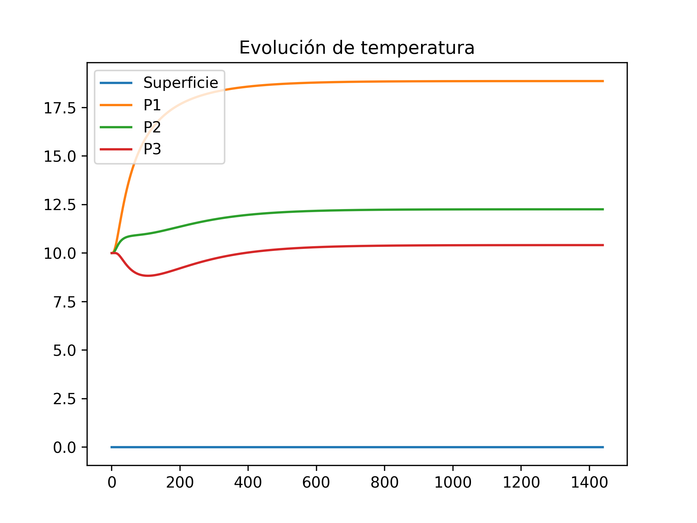
## Caso 5
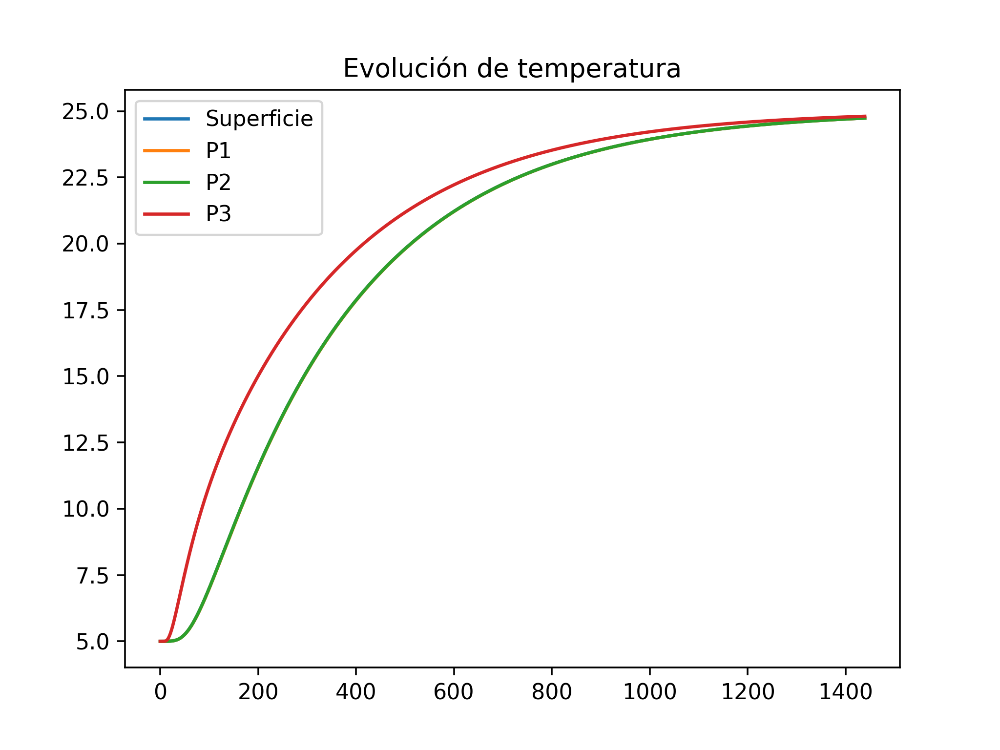
## Caso 6
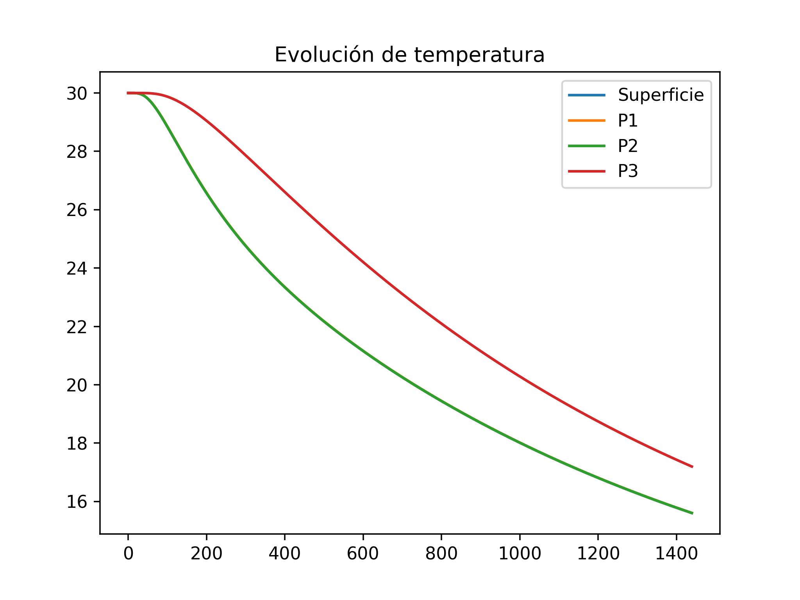
## Caso 7
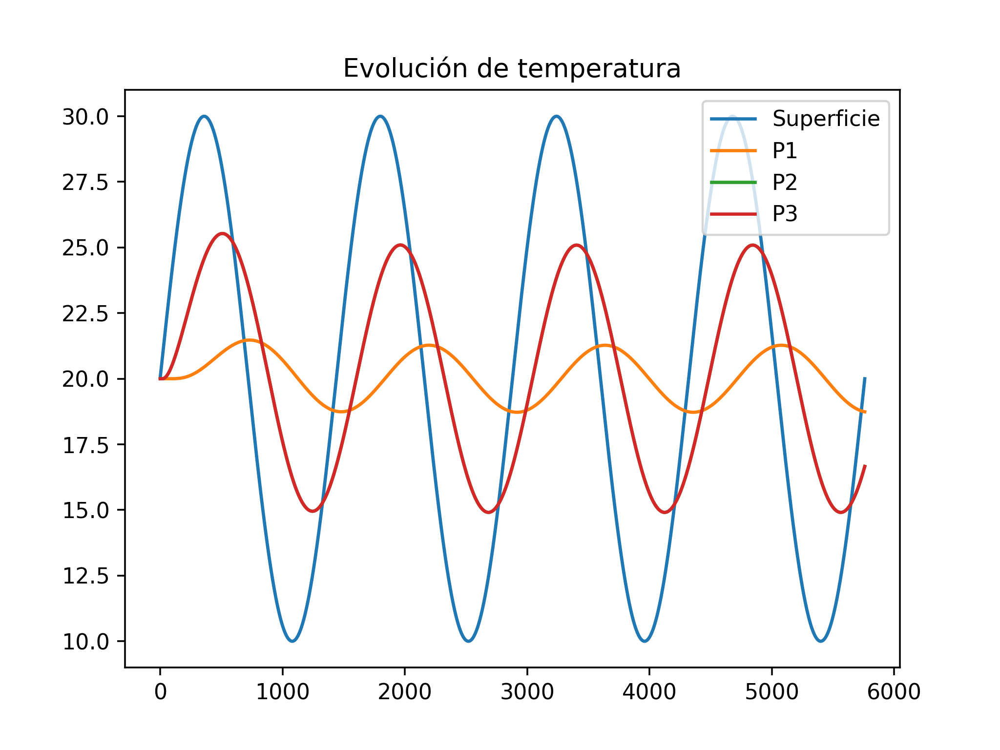

# Distribución de temperatura en los tiempos

