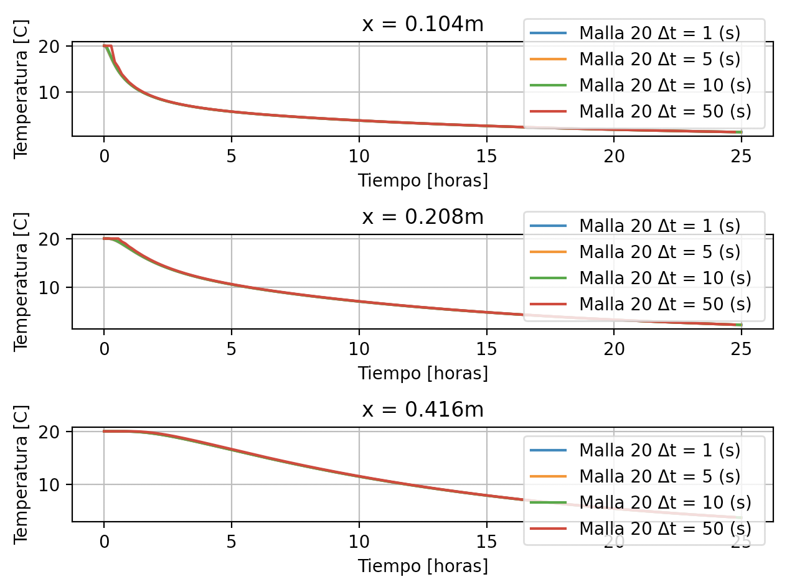
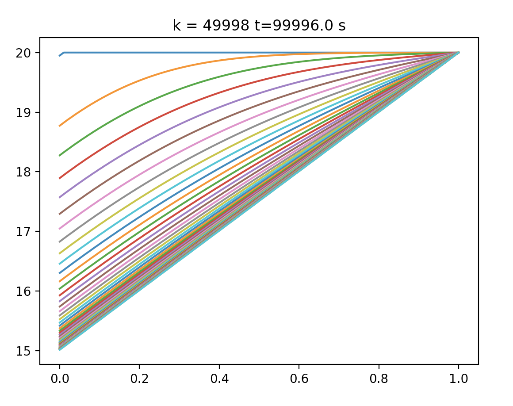

# Verificar código 1-D replicando los resultados de la sección 4.5 de la memoria de Contreras

Como se logra apreciar en los tres gráficos se observa que las curvas se mantienen bastante similares para distintos intervalos de tiempo, además estas curvas se asemejan bastante a la solución analítica.

# Discretización de la condición de borde natural

En primer lugar, para obtener la discretización de la condición de borde natural en el extremo izquierdo, se debieron aplicar las condiciones de borde de este caso particular, las que fueron las siguientes:
dudx(t,0)=5

u(0,x)=20

u(t,L)=20

Luego, con el fin de  poder aplicar la segunda ecuación se utilizó la siguiente expresión:

du/dx(t,L)=(u[k,N-1]-u[k,N-2])dx

Aplicando esta expresión con los valores de la primera condición de borde se obtiene:
du/dx(t,0)=(u[k,1]-u[k,0])/dx = 5

Resultando finalmente en:

 u(k,0)=u[k,1]-5dx

El siguiente gráfico se obtuvo al utilizar las condiciones de borde anteriormente descritas, un paso de integración dt = 2. Además, las curvas de evolución térmica se graficaron cada 1000 pasos hasta obtener 50000.

A partir del gráfico se puede observar que las soluciones cada vez más lineales terminan convergiendo a 20ºC. Con respecto a la condición de borde natural, esta puede ser aplicada cuando existen elementos de hormigón en contacto con otros elementos sólidos diferentes, lo que según se plantea en la memoria de A. Contreras (2020), esta condición de borde representa las de cuarto tipo, porlo que es importante la transferencia de calor y una serie de variables a tener en cuenta para este caso. 
